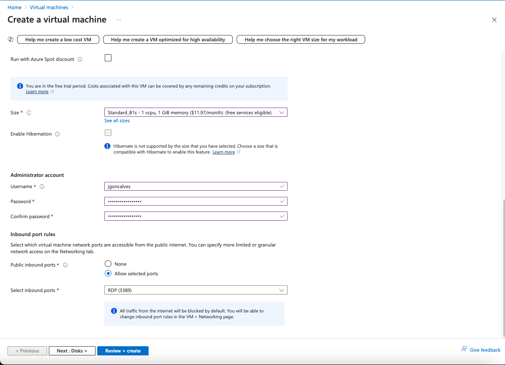
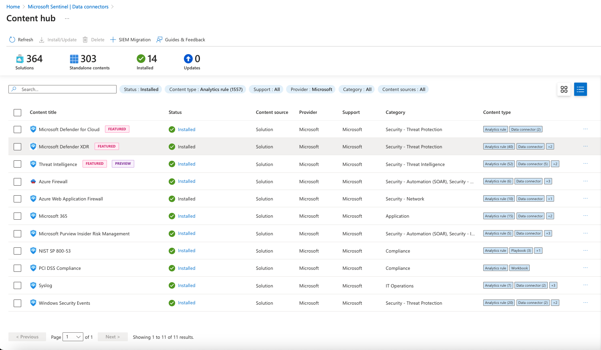
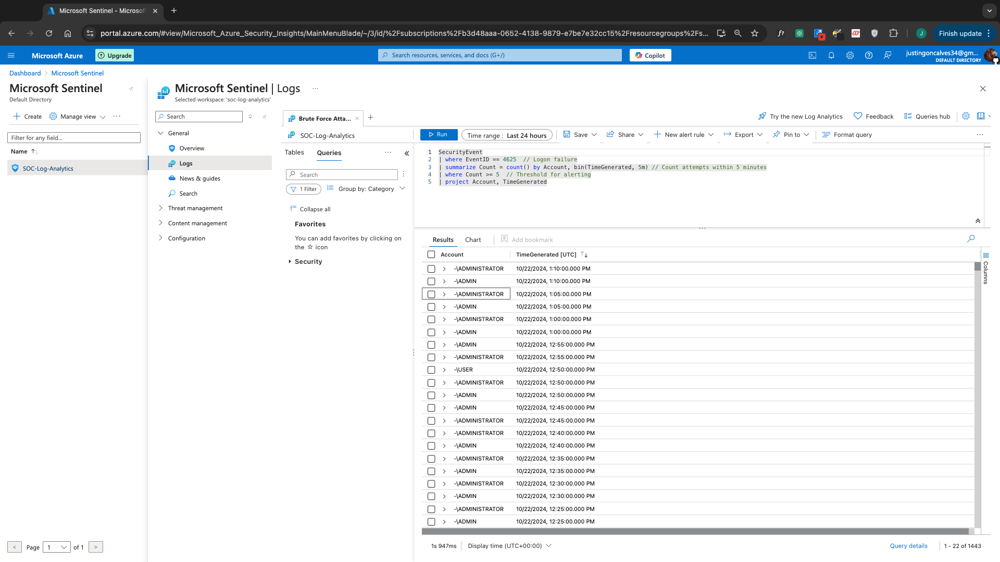
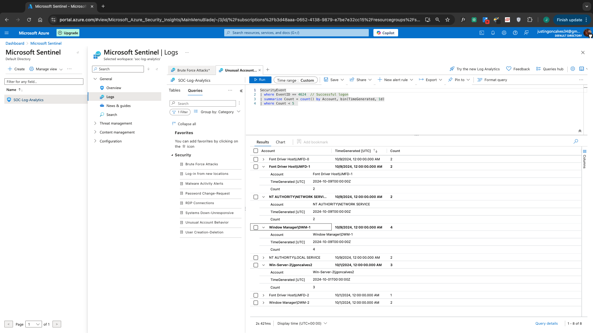
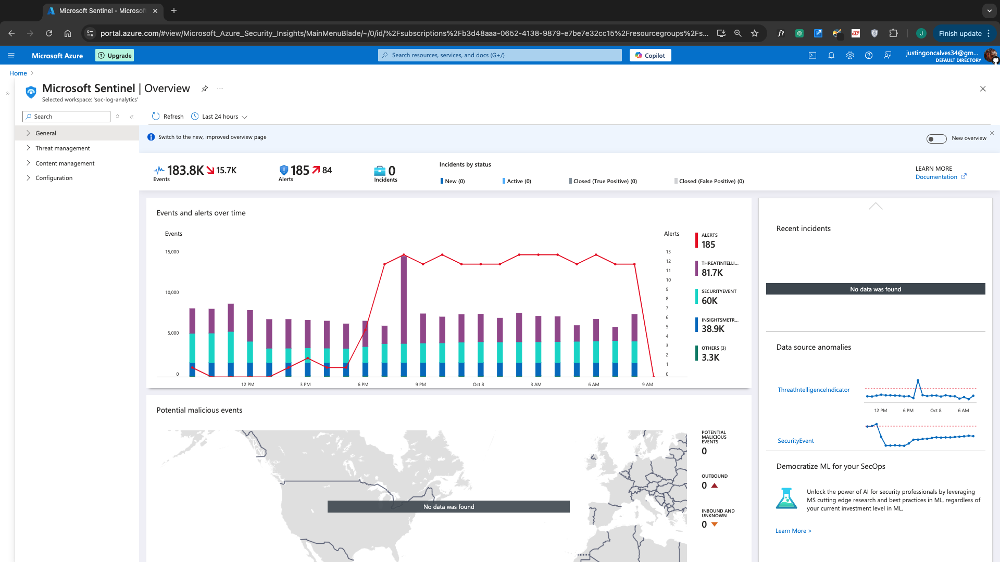
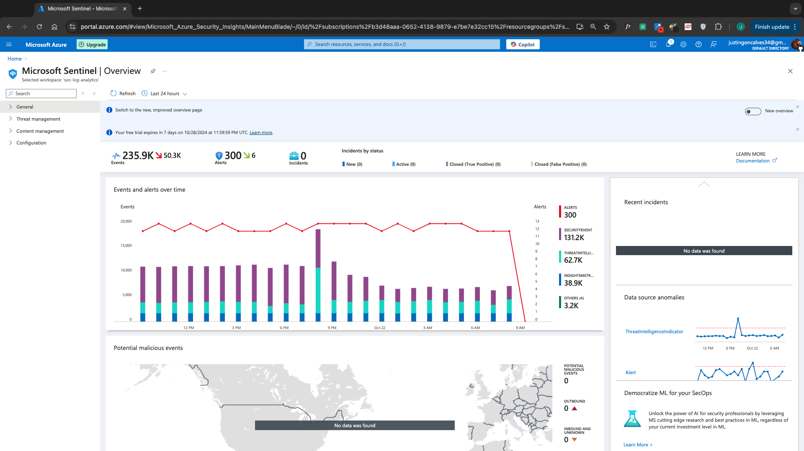
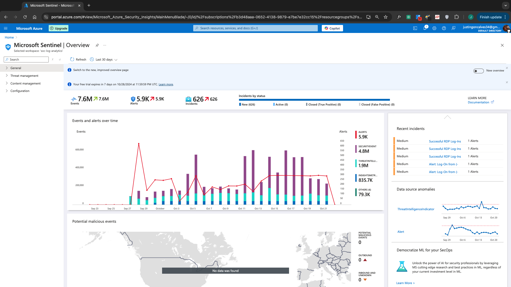

# Virtual SOC Environment 

---

[Back to Projects](Projects.md)

---

## Project Overview

The Virtual Security Operations Center (SOC) project was an ambitious endeavor aimed at establishing a comprehensive monitoring and incident response system in a cloud-based environment. Over the course of one month, I deployed multiple Windows 11 Pro virtual machines in Microsoft Azure, focusing on the real-time analysis of security events and the detection of potential threats. This project stands out not only for its technical implementation but also for its practical application in understanding the dynamics of cybersecurity threats in a virtual landscape.

Throughout the project, I monitored over **7.6 million events** and nearly **6,000 alerts**, demonstrating the volume and complexity of data that modern SOCs handle. The ability to track real-world brute force attacks provided invaluable insights into common attack vectors and the importance of maintaining vigilant monitoring practices. 

To enhance the effectiveness of my monitoring efforts, I implemented custom alert rules in Microsoft Sentinel, utilizing Kusto Query Language (KQL) to tailor responses to specific threats. This proactive approach to security ensured that only significant incidents triggered alerts, allowing for more efficient triage and response processes.

In addition to establishing a robust monitoring framework, this project underscored the necessity of having playbooks and incident response plans in place to address security events effectively. The hands-on experience gained from configuring data connectors and analyzing real-time alerts prepared me for the challenges of working within a Security Operations Center, reinforcing my commitment to continuous improvement in cybersecurity practices.

By combining technical skills with a deeper understanding of cybersecurity operations, this project has equipped me to contribute meaningfully to the field and better protect critical assets in future roles.

---

## Table of Contents

1. [Project Scope](#project-scope)
2. [Objectives](#objectives)
3. [Tools Used](#tools-used)
4. [Implementation](#implementation)
5. [Results](#results)
6. [Conclusion](#conclusion)
7. [Personal Reflection](#personal-reflection)

---

## Project Scope

The scope of this project is centered around the establishment of a Virtual Security Operations Center (SOC) within a cloud environment, utilizing Microsoft Azure and Microsoft Sentinel. The primary aim was to provide a comprehensive overview of how to monitor, detect, and respond to cybersecurity threats effectively.

Initially, I intended to deploy one Linux and one Windows server. Both servers were operational for a few days, but due to significantly higher activity observed on the Windows server, I decided to delete the Linux server and create a second Windows server. This adjustment allowed me to focus on monitoring real-world brute force attacks on both virtual machines.

I set up Microsoft Sentinel and Log Analytics to facilitate security monitoring, which involved creating multiple custom alert rules using Kusto Query Language (KQL) to detect potential threats and configuring data connectors through the content hub. The SOC was designed to actively monitor real-time attack attempts, particularly focusing on brute-force attacks directed at the deployed VMs.

Budget management was also crucial, as the project was conducted under the Azure Free Trial. I carefully monitored resource usage to avoid exceeding budget limits, utilizing the Cost Analysis dashboard to ensure the project remained within the confines of the available credits.

The project scope was primarily focused on logging and monitoring, ensuring that effective strategies were in place to detect and respond to cybersecurity threats while maximizing the use of the available resources.

---

## Objectives

The primary objectives of this project are as follows:

1. **Establish a Virtual SOC**: To create a functioning Virtual Security Operations Center using Azure and Microsoft Sentinel, providing a platform for monitoring and analyzing security events in real-time.
2. **Implement Real-time Logging and Alerting**: To configure virtual machines to generate and send security logs to Microsoft Sentinel, and to create alert rules that identify potential security threats.
3. **Utilize Data Connectors**: To leverage the content hub in Microsoft Sentinel to set up various data connectors, enhancing the capability to detect and respond to emerging threats.
4. **Monitor Brute Force Attacks**: To observe and analyze the real-time brute force attack attempts received by the deployed virtual machines, evaluating the effectiveness of the alerting mechanisms.
5. **Manage Budget**: To effectively manage the project's budget by utilizing the Azure free trial credits and monitoring the Cost Analysis dashboard, ensuring that the project remains within budget constraints.
6. **Evaluate Security Posture**: To assess the overall security posture of the virtual environment through the analysis of logged events and alerts, identifying potential vulnerabilities and areas for improvement.
7. **Analyze Attack Patterns**: To conduct an analysis of the attack patterns observed during the monitoring phase, helping to inform future security strategies and defenses.
8. **Enhance Technical Skills**: To improve my understanding and technical proficiency in using cloud security tools and best practices for incident response and monitoring.

---

## Tools Used

To effectively implement the Virtual Security Operations Center (SOC) and ensure robust monitoring and management, I utilized a variety of tools and technologies throughout the project:

1. **Microsoft Azure**: The primary platform for deploying virtual machines and services, providing the necessary infrastructure for creating the virtual environment and managing resources efficiently.
2. **Microsoft Sentinel**: This cloud-native Security Information and Event Management (SIEM) solution was instrumental in monitoring security events, creating alerts, and facilitating incident response in real-time.
3. **Log Analytics**: Integrated with Microsoft Sentinel, Log Analytics enabled the collection and analysis of logs from my virtual machines, offering valuable insights into security events and system health.
4. **Virtual Machines**: I deployed multiple VMs, including Windows 11 Pro, to test various security configurations and actively monitor real-time attack attempts.
5. **Content Hub**: This feature allowed me to access and configure various data connectors within Microsoft Sentinel, enhancing the SOC's capability to detect and respond to emerging threats.
6. **Dashboards**: I utilized Azure dashboards to manage and monitor resource usage and security alerts, ensuring effective oversight of the project's operational state and maintaining the overall integrity of the SOC.
7. **Kusto Query Language (KQL)**: I employed KQL for writing custom queries to extract, analyze, and visualize log data, facilitating efficient monitoring and alerting in the SOC.

---

## Implementation

### Configuration 

The implementation of the Virtual Security Operations Center (SOC) required several key decisions that significantly influenced the setup and functionality of the monitoring system. Initially, I deployed both a Windows virtual machine and a Linux virtual machine; however, I ultimately decided to delete the Linux server in favor of deploying two Windows 11 Pro VMs. This change was prompted by the notably higher activity levels observed on the Windows server compared to the Linux server. To facilitate the project's objectives, I intentionally left the RDP port open to monitor any malicious behavior or brute force attacks aimed at accessing the RDP. As a result, I concentrated my efforts on these two Windows VMs, enabling a more comprehensive monitoring experience of real-world brute force attacks.

   1. Below are the details showing the settings applied during the creation of the Windows Server 1 virtual machine.

*Configuration settings for the Windows Server 1 virtual machine.*

   2. To facilitate remote access, the RDP port was intentionally left open, allowing for monitoring and management of the VM without restrictions.

*The configuration screen indicating that the RDP port is allowed for the Windows Server.*

3. If a hacker were to successfully gain access to the RDP, they would encounter this popular meme featuring a sad and defeated Toy Story character, providing a humorous but stark reminder of the potential consequences of unauthorized access.

*This image shows the RDP desktop of the Windows server.*

### Monitoring

To facilitate effective security monitoring, I set up Microsoft Sentinel and Log Analytics. This involved creating custom alert rules using Kusto Query Language (KQL) to identify specific threats, such as brute force login attempts and unusual user behavior. The custom alert rules created in Microsoft Sentinel proved effective in identifying these threats, providing real-time notifications that facilitated prompt responses. 

I used the Content Hub in Microsoft Sentinel to integrate various data connectors. This allowed me to gather and analyze logs from different sources, providing a more holistic view of the security landscape. For instance, I configured Sentinel data connectors to collect logs from the Linux server and connected Windows Security Events to monitor the activities on the Windows VMs. Below is a screenshot of the Sentinel data connectors I configured:

I configured multiple custom rule alerts using KQL to enhance the monitoring capabilities of the SOC. The queries for these alerts were designed to capture various security events and behaviors, allowing me to respond quickly to potential threats. Below are some key custom alert rules that were implemented:

  1. **Brute Force Attempt Rule Alert**  
     
   *This query tracks repeated failed logon attempts, indicating a potential brute force attack.*

  2. **Password Change Attempt Rule Alert**  
     
   *This rule generates alerts for any password change requests made on the system.*

  3. **Systems Down Rule Alert**  
     
   *This alert monitors the heartbeat of the VMs to identify any unresponsive systems.*

  4. **Unusual Account Behavior Rule Alert**  
     
   *This query identifies unusual activities in user accounts that could indicate a potential security breach.*

The implementation of the Virtual Security Operations Center (SOC) involved deploying two Windows 11 Pro virtual machines and configuring Microsoft Sentinel for comprehensive log analysis. Custom alert rules utilizing Kusto Query Language (KQL) enabled efficient monitoring of security incidents, allowing for quick identification of threats. This phase not only provided insights into attack patterns but also established a strong foundation for effective incident management.

---

## Results

### September 28th 24-Hour Analytics

The results from September 28th, just two days after the initiation of the Virtual Security Operations Center (SOC) project, reveal significant activity within the environment. As illustrated in the image below, there were a total of **620 incidents**, **629 alerts**, and **203.4K events** recorded during this 24-hour period. Initially, the high number of incidents was largely due to the setup where every brute force attempt was logged as an incident. Recognizing that this was inefficient for monitoring and triaging alerts, I adjusted the configuration to ensure that only significant events, such as malware activity, account creation, RDP connections, and password change requests, would generate incidents in the future.

  
*Overview of incidents, alerts, and events in Microsoft Sentinel on September 28th.*

### October 8th 24-Hour Analytics

The results from October 8th reflect the continuous activity within the Virtual Security Operations Center (SOC) project. As shown in the image below, there were **185 alerts**, **183.8K events**, and **0 incidents** recorded during this 24-hour period. This significant decrease in incidents indicates that the alerting system adjustments made previously were effective. By refining the conditions for generating incidents, I ensured that only critical events, such as malware activity, account creation, RDP connections, and password change requests, would result in incidents, allowing for more efficient monitoring and response.

  
*Overview of incidents, alerts, and events in Microsoft Sentinel on October 8th.*

### October 14th 24-Hour Analytics

The results from October 14th show **256 alerts**, **273K events**, and **0 incidents** recorded during this period, as indicated in the image below. This data reflects the ongoing activity and monitoring within the system.

  
*Overview of incidents, alerts, and events in Microsoft Sentinel on October 14th.*

### October 22nd 24-Hour Analytics

The results from October 22nd show **300 alerts**, **235.9K events**, and **0 incidents** recorded during this period, as indicated in the image below. The data reflects ongoing monitoring activities within the system, with a notable number of alerts indicating various activities.

  
*Overview of incidents, alerts, and events in Microsoft Sentinel on October 22nd.*

### Overall Project Results

Throughout the duration of the project, the monitoring system captured a total of **7.6 million events**, resulting in **5.9K alerts** and **626 incidents**. These figures reflect the extensive activity monitored within the environment. Initially, the high number of incidents was primarily due to brute force attempts being logged as incidents, which created a cluttered monitoring experience. Recognizing this inefficiency, I adjusted the incident creation settings to ensure that only significant events—such as malware activity, account creations, RDP connections, and password change requests—would trigger incident alerts in the future. This change streamlined the monitoring process, allowing for more effective triage of actual security threats.

Upon analyzing the 24-hour logs, several patterns emerged. Notably, there were heightened peaks in alerts, particularly around **9 PM on October 8th**, suggesting potential increased attack activity during that time. Additionally, the majority of alerts were related to brute force attempts, emphasizing the ongoing threat of unauthorized access via weak passwords. 

Throughout the project, my primary focus was on reviewing the logs and alerts to ensure normal activities. I checked for legitimate logins and system maintenance tasks, confirming that any irregularities were promptly addressed. Significant alerts indicating potential unauthorized access were documented for further analysis, allowing for refinement of alert rules and enhancing monitoring accuracy.

  
*Overview of total events, alerts, and incidents logged during the project.*

Additionally, the project's budget was effectively managed, with a total expenditure of **$171.07** during the monitored period, demonstrating a commitment to cost-efficient operations while still achieving the project's objectives.

  
*Overview of the cost analysis dashboard showing project expenditure and resource allocation.*

---

## Conclusion

The implementation of the Virtual Security Operations Center (SOC) provided invaluable insights into the dynamics of monitoring and managing security within a virtual environment. Throughout the project, I deployed multiple Windows 11 Pro VMs and configured custom alert rules in Microsoft Sentinel, which allowed me to effectively monitor real-world brute force attacks and other security events. The results demonstrated the importance of adapting incident response strategies, as I adjusted alert triggers to enhance efficiency and focus on significant incidents.

By analyzing the patterns in alert generation, I identified peak activity times that informed my approach to monitoring and responding to potential threats. This project has equipped me with practical experience in using cloud-native security tools and has deepened my understanding of the complexities involved in safeguarding digital environments. Overall, the knowledge gained throughout this project has laid a solid foundation for future endeavors in cybersecurity.

---

## Personal Reflection

Reflecting on this month-long project, I realize the immense value of patience and persistence in the field of cybersecurity. The experience highlighted the critical importance of continuous monitoring to safeguard vital assets and infrastructure from potential threats. I learned firsthand how essential it is to have well-defined playbooks and incident response plans in place to efficiently address and mitigate security incidents as they arise.

This project has not only enhanced my technical skills but also provided me with a deeper appreciation for the processes and protocols necessary in a Security Operations Center (SOC) environment. I now feel more equipped to navigate the complexities of cybersecurity operations and am better prepared to contribute effectively in future roles. The lessons learned from monitoring real-time events and analyzing alerts have solidified my commitment to being proactive in identifying and responding to threats, ultimately making me a more competent and confident cybersecurity professional.

---

[Back to Projects](Projects.md)

---
